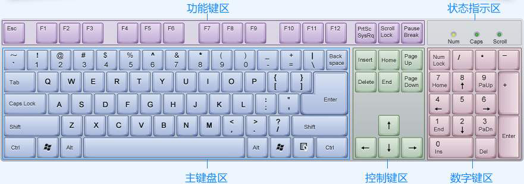

<!--
 * @Description: 快速开始
 * @Date: 2020-03-08 22:26:34
 * @LastEditors: Lorin
 * @LastEditTime: 2020-04-07 18:11:11
 -->

### 认识键盘

> 为了便于记忆，按照功能的不同，我们把键盘划分为主键盘区、功能键区、控制键区、数字键区以及状态指示区，如下图所示。

### 主键盘区

> 键盘中最常用的区域就是主键盘区，主键盘区中的键又分为三大类，即字母键、数字（符
[1212121212121234]

asdfghjkl
adklh hgjkl;s

qecxx;\/b1n2vrmiop

eakotwx

         ,y

