<!--
 * @Description: 认识键盘
 * @Date: 2020-03-08 22:26:34
 * @LastEditors: Lorin
 * @LastEditTime: 2020-04-07 18:53:45
 -->

### 认识键盘

> 为了便于记忆，按照功能的不同，我们把键盘划分为主键盘区、功能键区、控制键区、数字键区以及状态指示区，如下图所示。为 101 键键盘

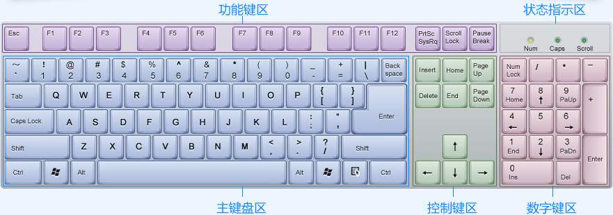
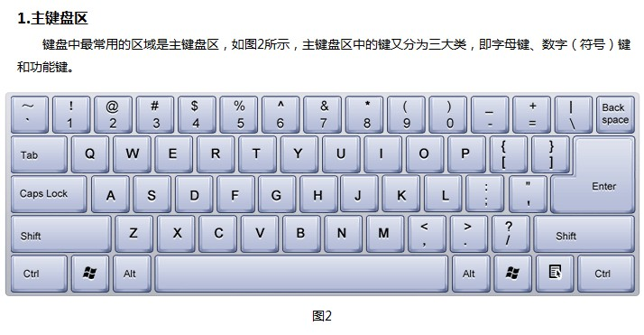
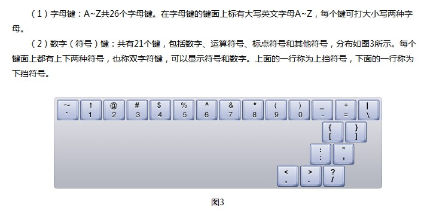
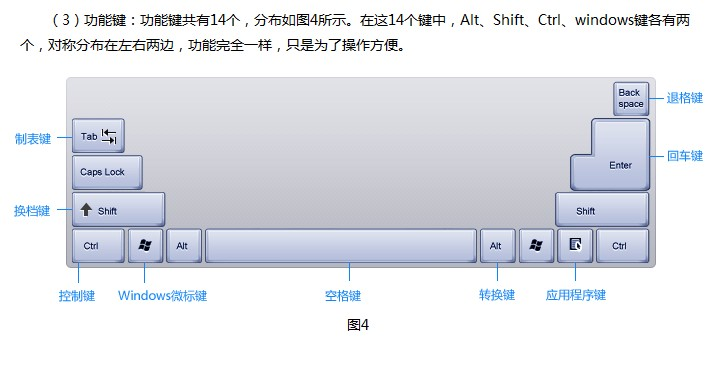
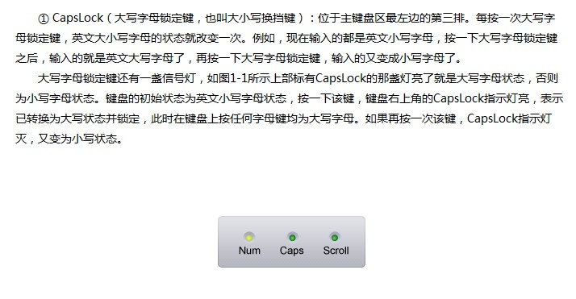
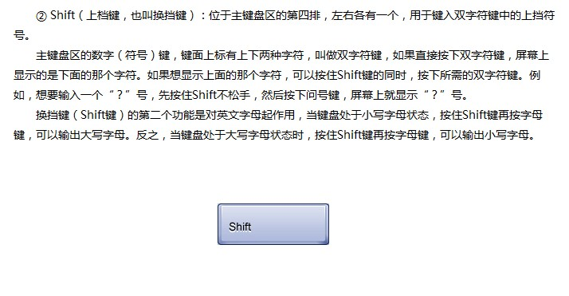
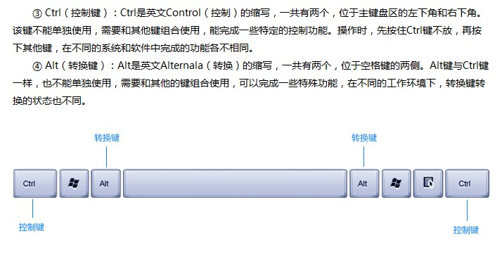
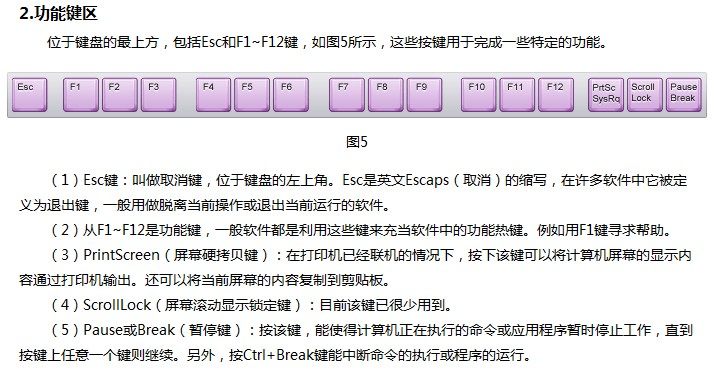
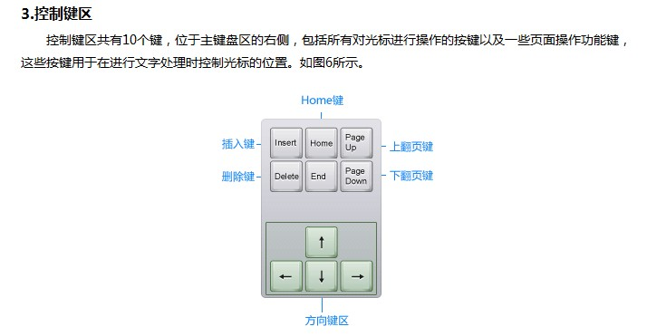
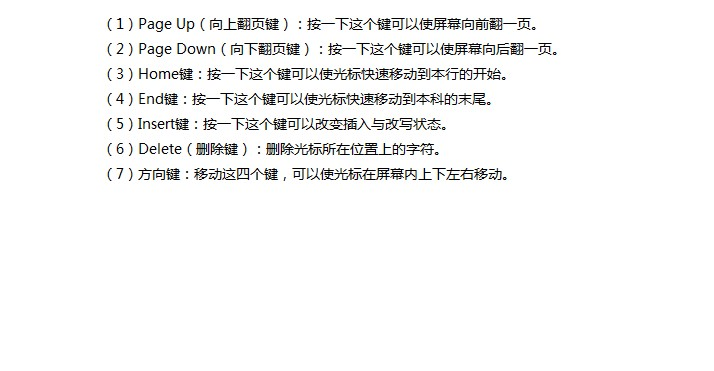
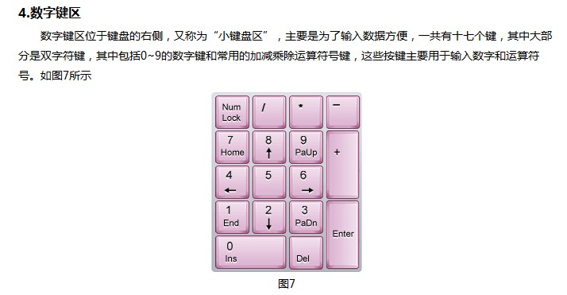
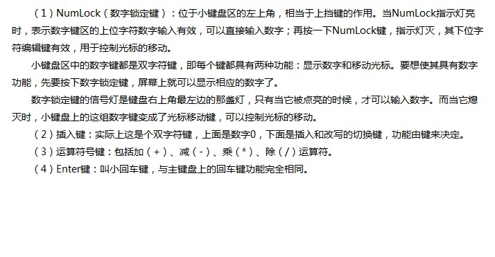
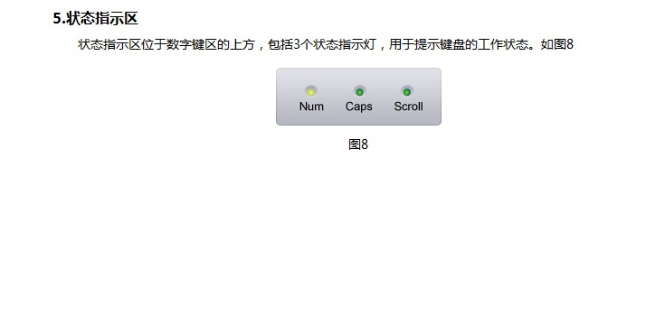

> 其他键盘 104，107 键键盘

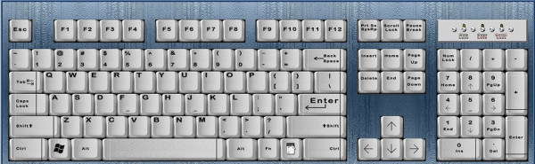
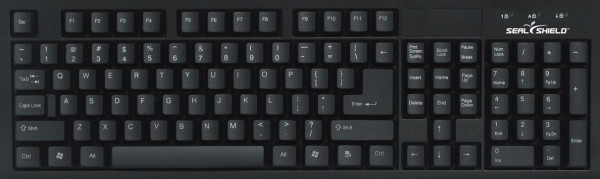